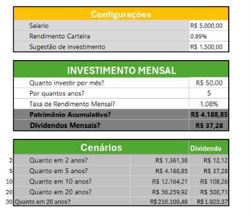

# Projeto-Investimento-fundoImobiliario

# 📈 Simulador de Planejamento e Acúmulo de Investimentos

Este repositório contém uma ferramenta de planejamento financeiro desenvolvida em **Microsoft Excel** (`EXCEL-INVESTIMENTO.xlsx`), voltada para simular cenários de aportes mensais, cálculo de juros compostos e projeção de renda passiva (dividendos) ao longo do tempo.

---

## 🎯 Objetivo do Projeto

Apoiar o investidor na tomada de decisão financeira, permitindo:
- Definir percentuais de economia com base na renda mensal.
- Projetar o crescimento patrimonial com aportes regulares.
- Visualizar o efeito dos juros compostos em curto, médio e longo prazo.
- Estimar a geração mensal de renda passiva (dividendos) para cada horizonte temporal.

---

## 📸 Demonstração Visual

Abaixo está a interface do simulador com os módulos de configuração, cálculo pontual e análise multitemporal:

--

## 🧩 Estrutura da Planilha

A ferramenta é dividida em três seções principais:

### 1. Configurações Iniciais
- **Salário:** Definição da base de renda do investidor.
- **Rendimento da Carteira:** Meta de rentabilidade média mensal da carteira.
- **Sugestão de Investimento:** Cálculo/reserva sugerida para aportes periódicos.

### 2. Simulador de Investimento Mensal
Módulo de cálculo interativo para simulação direta:
- **Aporte Mensal:** Valor recorrente a ser investido por mês.
- **Prazo:** Período de investimento estipulado em anos.
- **Taxa de Rendimento:** Percentual de retorno esperado ao mês.
- **Resultados:**
  - **Patrimônio Acumulado:** Total projetado (aportes + rendimentos compostos).
  - **Dividendos Mensais:** Renda passiva estimada gerada pelo montante final acumulado.

### 3. Tabela de Cenários (Projeção Multitemporal)
Compara a evolução patrimonial e a renda passiva mensal gerada para diferentes horizontes com a mesma taxa e aporte:
- **2 anos**
- **5 anos**
- **10 anos**
- **20 anos**
- **30 anos**

---

## 🛠️ Tecnologias e Recursos Utilizados

- **Microsoft Excel**
  - Fórmulas financeiras (`VF` / Valor Futuro, juros compostos).
  - Formatação condicional e organização visual por blocos.
  - Modelagem de cenários para finanças pessoais.

---

## 📂 Arquivos no Repositório

- `EXCEL-INVESTIMENTO.xlsx`: Arquivo da planilha de cálculo.
- `/images`: Pasta com as capturas de tela e demonstrações da planilha.
- `README.md`: Documentação técnica e guia do projeto.

---

## 🚀 Como Utilizar

1. Baixe o arquivo [`EXCEL-INVESTIMENTO.xlsx`](./EXCEL-INVESTIMENTO.xlsx) deste repositório.
2. Abra no **Microsoft Excel**, **Google Planilhas** ou **LibreOffice Calc**.
3. Altere os campos de entrada (Salário, Aporte Mensal, Anos e Taxa) para analisar seus próprios cenários de investimento.
